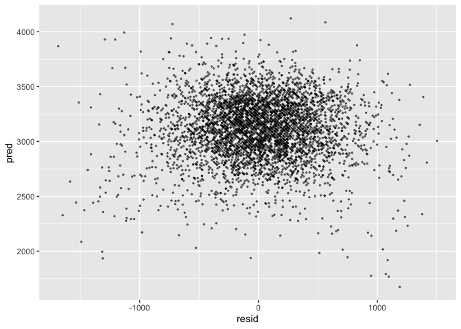
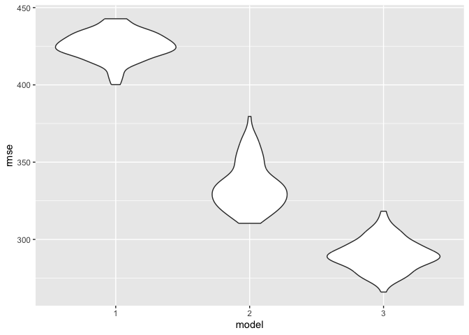

p8105_hw6_jer2243
================
Juliet Rowe
2023-11-20

## Problem 2

Load libraries

``` r
library(tidyverse)
```

    ## ── Attaching core tidyverse packages ──────────────────────── tidyverse 2.0.0 ──
    ## ✔ dplyr     1.1.2     ✔ readr     2.1.4
    ## ✔ forcats   1.0.0     ✔ stringr   1.5.0
    ## ✔ ggplot2   3.4.2     ✔ tibble    3.2.1
    ## ✔ lubridate 1.9.2     ✔ tidyr     1.3.0
    ## ✔ purrr     1.0.1     
    ## ── Conflicts ────────────────────────────────────────── tidyverse_conflicts() ──
    ## ✖ dplyr::filter() masks stats::filter()
    ## ✖ dplyr::lag()    masks stats::lag()
    ## ℹ Use the conflicted package (<http://conflicted.r-lib.org/>) to force all conflicts to become errors

``` r
library(modelr)
library(mgcv)
```

    ## Loading required package: nlme
    ## 
    ## Attaching package: 'nlme'
    ## 
    ## The following object is masked from 'package:dplyr':
    ## 
    ##     collapse
    ## 
    ## This is mgcv 1.9-0. For overview type 'help("mgcv-package")'.

``` r
library(dplyr)
library(knitr)

set.seed(1)
```

Download data

``` r
weather_df = 
  rnoaa::meteo_pull_monitors(
    c("USW00094728"),
    var = c("PRCP", "TMIN", "TMAX"), 
    date_min = "2022-01-01",
    date_max = "2022-12-31") |>
  mutate(
    name = recode(id, USW00094728 = "CentralPark_NY"),
    tmin = tmin / 10,
    tmax = tmax / 10) |>
  select(name, id, everything())
```

    ## using cached file: /Users/Juliet/Library/Caches/org.R-project.R/R/rnoaa/noaa_ghcnd/USW00094728.dly

    ## date created (size, mb): 2023-09-28 10:19:41.395166 (8.524)

    ## file min/max dates: 1869-01-01 / 2023-09-30

Create bootstrap with 5000 samples

``` r
bootstrap_results = weather_df |> 
  modelr::bootstrap(n = 5000) |> 
  mutate(
    models = map(strap, \(df) lm(tmax ~ tmin + prcp, data = df)),
    results = map(models, broom::tidy),
    rsq = map(models, broom::glance)) |> 
  select(results, .id, rsq) |> 
  unnest(results) |>
  filter(term %in% c("tmin", "prcp")) |>
  group_by(.id) |>
  mutate(beta1xbeta2 = prod(estimate),
         log_beta_product = log(beta1xbeta2)) |>
  select(log_beta_product, rsq) |>
  unnest(rsq) |>
  janitor::clean_names() |>
  select(log_beta_product, id, r_squared) |>
  unique()
```

    ## Warning: There were 3361 warnings in `mutate()`.
    ## The first warning was:
    ## ℹ In argument: `log_beta_product = log(beta1xbeta2)`.
    ## ℹ In group 2: `.id = "0002"`.
    ## Caused by warning in `log()`:
    ## ! NaNs produced
    ## ℹ Run `dplyr::last_dplyr_warnings()` to see the 3360 remaining warnings.

    ## Adding missing grouping variables: `.id`

Plot distribution of log_beta_product

``` r
bootstrap_results |>
  ggplot(aes(x=log_beta_product)) + geom_density()
```

    ## Warning: Removed 3361 rows containing non-finite values (`stat_density()`).

<!-- -->
The distribution of the bootstrap estimates of the log of the product of
beta 1 and beta 2 is left skewed, unimodal, and peaks at around -5.5.

Plot distribution of r-squared

``` r
bootstrap_results |>
  ggplot(aes(x=r_squared)) + geom_density()
```

<!-- -->
The distribution of the bootstrap estimates of r-squared is slightly
left-skewed, unimodal, and peaks at around 0.92.

Calculate number of log(beta1xbeta2) that are undefined

``` r
nan_count <- bootstrap_results |>
  pull("log_beta_product") |>
  is.nan() |>
  sum()
```

3361 out of 5000 observations for log(beta1xbeta2) are undefined.

Calculate 95% CI for r-squared and log beta product

``` r
bootstrap_CIs = bootstrap_results |>
  unique() |> ungroup() |> select(-id) |> summarize(betas_mean = mean(log_beta_product, na.rm=TRUE),
                                              betas_low = quantile(log_beta_product, 0.025, na.rm=TRUE),
                                              betas_high = quantile(log_beta_product, 0.975, na.rm=TRUE),
                                              rsq_mean = mean(r_squared),
                                              rsq_low = quantile(r_squared, 0.025),
                                              rsq_high = quantile(r_squared, 0.975))
bootstrap_CIs |> knitr::kable()
```

| betas_mean | betas_low | betas_high |  rsq_mean |   rsq_low |  rsq_high |
|-----------:|----------:|-----------:|----------:|----------:|----------:|
|  -6.089813 | -8.981559 |  -4.601673 | 0.9168349 | 0.8885495 | 0.9406812 |

The 95% CI for log(beta1xbeta2) = (-8.9815594, -4.6016727). The 95% CI
for log(beta1xbeta2) = (0.8885495, 0.9406812).

## Problem 3

Load and clean data

variables to convert to factor: babysex, frace, malform, mrace

``` r
birthweight_df <- read.csv("birthweight.csv")

birthweight_df = birthweight_df |>
  janitor::clean_names() |>
  mutate(
    babysex = as.factor(babysex),
    frace = as.factor(frace),
    malform = as.factor(malform),
    mrace = as.factor(mrace)
  ) |>
  drop_na()
```

Proposed regression for birthweight

``` r
fit = lm(bwt ~ babysex + delwt + gaweeks + mrace + parity + smoken, data = birthweight_df)

fit |>
  broom::tidy() |>
  select(term, estimate, p.value) |>
  knitr::kable(digits=3)
```

| term        | estimate | p.value |
|:------------|---------:|--------:|
| (Intercept) |  319.581 |   0.000 |
| babysex2    |  -89.900 |   0.000 |
| delwt       |    5.845 |   0.000 |
| gaweeks     |   55.119 |   0.000 |
| mrace2      | -292.606 |   0.000 |
| mrace3      |  -65.371 |   0.321 |
| mrace4      | -136.197 |   0.000 |
| parity      |  118.933 |   0.058 |
| smoken      |  -11.786 |   0.000 |

``` r
summary(fit)
```

    ## 
    ## Call:
    ## lm(formula = bwt ~ babysex + delwt + gaweeks + mrace + parity + 
    ##     smoken, data = birthweight_df)
    ## 
    ## Residuals:
    ##      Min       1Q   Median       3Q      Max 
    ## -1685.72  -260.00     5.52   271.68  1502.45 
    ## 
    ## Coefficients:
    ##              Estimate Std. Error t value Pr(>|t|)    
    ## (Intercept)  319.5810    90.2158   3.542 0.000401 ***
    ## babysex2     -89.9000    12.9058  -6.966 3.76e-12 ***
    ## delwt          5.8453     0.2953  19.797  < 2e-16 ***
    ## gaweeks       55.1189     2.1018  26.225  < 2e-16 ***
    ## mrace2      -292.6060    14.0206 -20.870  < 2e-16 ***
    ## mrace3       -65.3711    65.8020  -0.993 0.320545    
    ## mrace4      -136.1974    29.0358  -4.691 2.81e-06 ***
    ## parity       118.9326    62.7735   1.895 0.058208 .  
    ## smoken       -11.7863     0.9002 -13.092  < 2e-16 ***
    ## ---
    ## Signif. codes:  0 '***' 0.001 '**' 0.01 '*' 0.05 '.' 0.1 ' ' 1
    ## 
    ## Residual standard error: 424.1 on 4333 degrees of freedom
    ## Multiple R-squared:  0.3155, Adjusted R-squared:  0.3142 
    ## F-statistic: 249.6 on 8 and 4333 DF,  p-value: < 2.2e-16

My proposed model for birthweight includes `delwt`, mother’s weight at
delivery, `gaweeks`, gestational age in weeks, `mrace`, mother’s race,
`parity`, number of live births prior to this pregnancy, and `smoken`,
average number of cigarettes smoked per day during pregnancy. I chose
these variables because I know that they are all likely to have a
biological effect on fetal development and therefore the birthweight of
the baby when it is born. The p-values for all of these variables, aside
from 0.321, are quite small so it seems like my hypothesized model was
pretty good!

Plot of residuals against fitted values

``` r
birthweight_df |>
  modelr::add_residuals(fit) |>
  modelr::add_predictions(fit) |>
  ggplot(aes(x=resid, y=pred)) + geom_point(alpha=0.5, size=0.5)
```

<!-- -->
The plot of residuals against fitted values appears to be clustered
around 0, with the average predicted value looking to be around 3200
grams for birthweight. This appears to be a decent fit, although there
are a good amount of outliers.

Cross-validation comparison

``` r
cv_df = 
  crossv_mc(birthweight_df, 100) 

cv_df =
  cv_df |> 
  mutate(
    train = map(train, as_tibble),
    test = map(test, as_tibble))

cv_df = 
  cv_df |> 
  mutate(
    mod_1  = map(train, \(df) lm(bwt ~ babysex + delwt + gaweeks + mrace + parity + smoken, data = df)),
    mod_2  = map(train, \(df) lm(bwt ~ blength + gaweeks, data=df)),
    mod_3  = map(train, \(df) lm(bwt ~ bhead + blength + babysex + bhead*blength + bhead*babysex + blength*babysex + bhead*blength*babysex, data=df))) |> 
  mutate(
    rmse_1 = map2_dbl(mod_1, test, \(mod, df) rmse(model = mod, data = df)),
    rmse_2 = map2_dbl(mod_2, test, \(mod, df) rmse(model = mod, data = df)),
    rmse_3 = map2_dbl(mod_3, test, \(mod, df) rmse(model = mod, data = df)))

cv_df |>
  select(starts_with("rmse")) |>
  pivot_longer(
    everything(), names_to="model", values_to="rmse", names_prefix="rmse_") |>
  ggplot(aes(x=model, y=rmse)) + geom_violin()
```

<!-- -->

Based on the RMSE values, it looks like the 3rd model with the
interaction terms is the best fit. This model has significantly lower
RMSE values than the other two.
