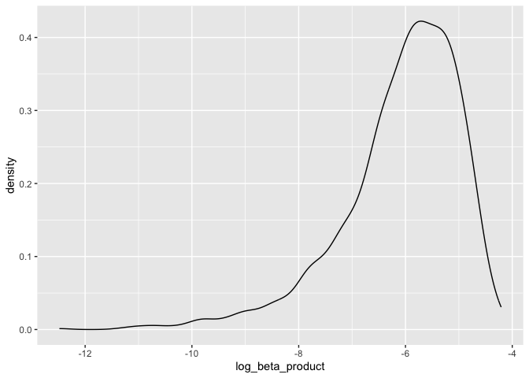

p8105_hw6_jer2243
================
Juliet Rowe
2023-11-20

## Problem 2

Load libraries

``` r
library(tidyverse)
```

    ## ── Attaching core tidyverse packages ──────────────────────── tidyverse 2.0.0 ──
    ## ✔ dplyr     1.1.2     ✔ readr     2.1.4
    ## ✔ forcats   1.0.0     ✔ stringr   1.5.0
    ## ✔ ggplot2   3.4.2     ✔ tibble    3.2.1
    ## ✔ lubridate 1.9.2     ✔ tidyr     1.3.0
    ## ✔ purrr     1.0.1     
    ## ── Conflicts ────────────────────────────────────────── tidyverse_conflicts() ──
    ## ✖ dplyr::filter() masks stats::filter()
    ## ✖ dplyr::lag()    masks stats::lag()
    ## ℹ Use the conflicted package (<http://conflicted.r-lib.org/>) to force all conflicts to become errors

``` r
set.seed(1)
```

Download data

``` r
weather_df = 
  rnoaa::meteo_pull_monitors(
    c("USW00094728"),
    var = c("PRCP", "TMIN", "TMAX"), 
    date_min = "2022-01-01",
    date_max = "2022-12-31") |>
  mutate(
    name = recode(id, USW00094728 = "CentralPark_NY"),
    tmin = tmin / 10,
    tmax = tmax / 10) |>
  select(name, id, everything())
```

    ## using cached file: /Users/Juliet/Library/Caches/org.R-project.R/R/rnoaa/noaa_ghcnd/USW00094728.dly

    ## date created (size, mb): 2023-09-28 10:19:41.395166 (8.524)

    ## file min/max dates: 1869-01-01 / 2023-09-30

Create bootstrap with 5000 samples

``` r
bootstrap_results = weather_df |> 
  modelr::bootstrap(n = 5000) |> 
  mutate(
    models = map(strap, \(df) lm(tmax ~ tmin + prcp, data = df)),
    results = map(models, broom::tidy),
    rsq = map(models, broom::glance)) |> 
  select(results, .id, rsq) |> 
  unnest(results) |>
  filter(term %in% c("tmin", "prcp")) |>
  group_by(.id) |>
  mutate(beta1xbeta2 = prod(estimate),
         log_beta_product = log(beta1xbeta2)) |>
  select(log_beta_product, rsq) |>
  unnest(rsq) |>
  janitor::clean_names() |>
  select(log_beta_product, id, r_squared) |>
  unique()
```

    ## Warning: There were 3361 warnings in `mutate()`.
    ## The first warning was:
    ## ℹ In argument: `log_beta_product = log(beta1xbeta2)`.
    ## ℹ In group 2: `.id = "0002"`.
    ## Caused by warning in `log()`:
    ## ! NaNs produced
    ## ℹ Run `dplyr::last_dplyr_warnings()` to see the 3360 remaining warnings.

    ## Adding missing grouping variables: `.id`

Plot distribution of log_beta_product

``` r
bootstrap_results |>
  ggplot(aes(x=log_beta_product)) + geom_density()
```

    ## Warning: Removed 3361 rows containing non-finite values (`stat_density()`).

<!-- -->
The distribution of the bootstrap estimates of the log of the product of
beta 1 and beta 2 is left skewed, unimodal, and peaks at around -5.5.

Plot distribution of r-squared

``` r
bootstrap_results |>
  ggplot(aes(x=r_squared)) + geom_density()
```

<!-- -->
The distribution of the bootstrap estimates of r-squared is slightly
left-skewed, unimodal, and peaks at around 0.92.

Calculate 95% CI for log beta product and r-squared

## Problem 3

Load and clean data

variables want to convert to factor: babysex, frace, malform, mrace

``` r
birthweight_df <- read.csv("birthweight.csv")

birthweight_df = birthweight_df |>
  janitor::clean_names() |>
  mutate(
    babysex = as.factor(babysex),
    frace = as.factor(frace),
    malform = as.factor(malform),
    mrace = as.factor(mrace)
  ) |>
  drop_na()
```
